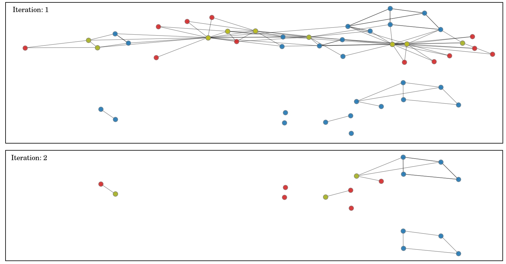

# A polytime preprocess algorithm for the maximum independent set problem

This repository contains the code, data, and results for "A polytime preprocess algorithm for the maximum independent set problem" by Samuel Kroger, Hamidreza Validi, and Illya V. Hicks.

An independent set $I \subseteq V$ of a graph $G=(V,E)$ is a set such that the subgraph induced by $I$ (i.e., $G[I]$) has no edges. The maximum independent set problem aims to find a largest independent set in a graph. The maximum cardinality independent set problem is NP-hard. We propose a polytime algorithm that can fix binary decision variables of a classical mixed integer programming formulation of the problem. The preprocessing algorithm is illustrated for the karate graph below. The proposed algorithm runs in two iterations; the red nodes denote a maximum independent set of simplicial nodes, which we can fix to one; the yellow nodes are the neighbors of the red nodes that we can be fixed to zero, and the blue nodes are the remaining nodes.




# What is in the repository and how to use the code.

All of the data used in the paper is in the directory data. All images generated for the paper are in the images folder. There are four csv files:

- graph_info.csv contains some basic information on the instances, it can be generated by leaving line 319 uncommented in comp_experiment.py
- results.csv contains all the computational results used in the paper.
- optimal_solutions.csv and timed_out_instances.csv are just the contents of results.csv manually formatted for the paper.

You can replicate these results on your machine by cloning the repository and executing the following command

```
.\comp_expermient.py
```
